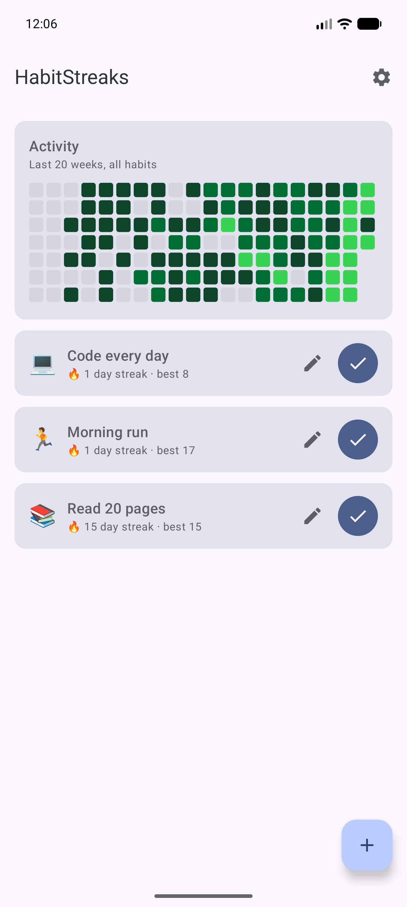

# HabitStreaks 🔥

[](https://github.com/Meko123456/HabitStreaks/actions/workflows/ci.yml)
[](https://github.com/Meko123456/HabitStreaks/releases)
[](LICENSE)

Track your habits GitHub-style — green squares, streaks, and your **real GitHub
contribution graph** pulled live via the GraphQL API.

Born from a real 90-day challenge (10+ GitHub contributions a day). HabitStreaks
tracks any daily habit with streaks and a familiar green-squares heatmap — and for
the coding habit, it doesn't ask you to self-report: it fetches your actual squares.

<p align="center">
  
</p>

## Features

- ✅ Create habits with emoji, check them off daily, edit or delete any time
- 🔥 Streak tracking with an until-midnight grace rule (today unchecked ≠ broken streak)
- 🟩 Contribution-style activity heatmap drawn on a single Compose Canvas
- 🐙 Connect GitHub: your real contribution calendar and yearly total, in-app
- 📱 **Two Glance home-screen widgets:**
  - *HabitStreaks* — today's habits with tap-to-check straight into the database
  - *GitHub Graph* — your live GitHub contribution heatmap on the home screen
- ⏰ Evening reminder if habits are still open (WorkManager, Android 13+ permission flow)
- 🔐 GitHub token stored encrypted — AES-256-GCM key in the Android Keystore
- 📴 Offline-first: habits and completions live in Room

## Tech stack

Kotlin · Jetpack Compose (Material 3, dynamic color) · Room (KSP) ·
Ktor Client (GitHub GraphQL) · kotlinx-serialization · Glance · WorkManager

## Architecture

```
ui/         Compose screens + HabitsViewModel (StateFlow, reactive Room queries)
domain/     StreakEngine + HeatmapLevel — pure Kotlin, fully unit tested
data/       Room entities/DAO/database
data/github TokenStore (Keystore AES-GCM) + GraphQL client + DTO mapping
widget/     Glance widgets + shared HeatmapBitmap renderer
reminders/  WorkManager daily reminder worker
```

The streak and heatmap math is deliberately isolated from Android — pure Kotlin
functions over `LocalDate.toEpochDay()` sets, exhaustively unit-tested (24 tests).

## Connecting your GitHub account

1. GitHub → Settings → Developer settings → Personal access tokens (classic) →
   generate one with the **`read:user`** scope (or no scopes for public data only)
2. In HabitStreaks: ⚙️ → paste token → Connect

The token is encrypted with a key that never leaves the Android Keystore and is
used for exactly one query (`viewer.contributionsCollection`). Nothing is ever
written to your account.

## Building

```bash
./gradlew :app:assembleDebug     # build
./gradlew :app:testDebugUnitTest # run unit tests
```

Requires JDK 17+. CI runs build + lint + tests on every push.

## License

[MIT](LICENSE)
