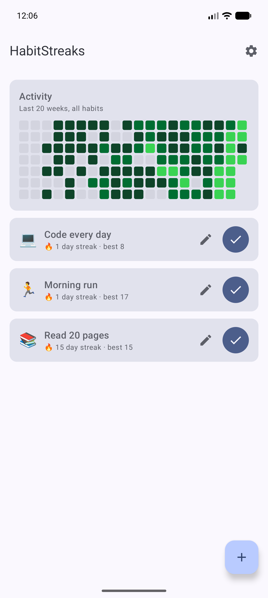

# HabitStreaks 🔥

[](https://github.com/Meko123456/HabitStreaks/actions/workflows/ci.yml)
[](https://github.com/Meko123456/HabitStreaks/releases)
[](LICENSE)

Track your habits GitHub-style — green squares, streaks, and your **real GitHub
contribution graph** pulled live via the GraphQL API.

Born from a real 90-day challenge (10+ GitHub contributions a day). HabitStreaks
tracks any daily habit with streaks and a familiar green-squares heatmap — and for
the coding habit, it doesn't ask you to self-report: it fetches your actual squares.

<p align="center">
  
</p>

## Features

- 📅 **Pick a day** — tap any heatmap cell (or use the date picker) to open that day: see and fix a habit's check-offs after the fact, or see that day's GitHub contribution count with a link to github.com. Tap support comes from `heatmap` 0.2.0.
- ✅ Create habits with emoji, check them off daily, edit or delete any time
- 🔥 Streak tracking with an until-midnight grace rule (today unchecked ≠ broken streak)
- 🟩 Contribution-style activity heatmap drawn on a single Compose Canvas
- 🐙 Connect GitHub: your real contribution calendar and yearly total, in-app
- 📱 **Two Glance home-screen widgets:**
  - *HabitStreaks* — today's habits with tap-to-check straight into the database
  - *GitHub Graph* — your live GitHub contribution heatmap on the home screen
- ⏰ Evening reminder if habits are still open (WorkManager, Android 13+ permission flow)
- 🔐 GitHub token stored encrypted — AES-256-GCM key in the Android Keystore
- 📴 Offline-first: habits and completions live in Room

## Tech stack

Kotlin · Jetpack Compose (Material 3, dynamic color) · Room (KSP) ·
Ktor Client (GitHub GraphQL) · kotlinx-serialization · Glance · WorkManager

## Architecture

```
ui/         Compose screens + HabitsViewModel (StateFlow, reactive Room queries)
domain/     StreakEngine + HeatmapLevel — pure Kotlin, fully unit tested
data/       Room entities/DAO/database
data/github TokenStore (Keystore AES-GCM) + GraphQL client + DTO mapping
widget/     Glance widgets + shared HeatmapBitmap renderer
reminders/  WorkManager daily reminder worker
```

The streak math and the day arithmetic are deliberately isolated from Android — pure Kotlin
functions over `LocalDate.toEpochDay()` sets and `ZonedDateTime`, unit-tested without a device
(19 tests in `domain/`, 37 in the repo, and three more that need a device — below).

## Connecting your GitHub account

1. GitHub → Settings → Developer settings → Personal access tokens (classic) →
   generate one with the **`read:user`** scope (or no scopes for public data only)
2. In HabitStreaks: ⚙️ → paste token → Connect

The token is encrypted with a key that never leaves the Android Keystore and is
used for exactly one query (`viewer.contributionsCollection`). Nothing is ever
written to your account.

## Building

```bash
./gradlew :app:assembleDebug     # build
./gradlew :app:testDebugUnitTest # run unit tests
```

Requires JDK 17+. CI runs build + lint + tests on every push.

### The widget on a real phone

`GithubWidgetOnDeviceTest` is the one test that needs a device. It hosts the GitHub widget
itself, sends it the largest heatmap it can draw, and measures the platform's bitmap cap on
that display. To run it on an Android 17 Pixel 11 in Firebase Test Lab:

```bash
./gradlew :app:assembleDebug :app:assembleDebugAndroidTest
gcloud firebase test android run --type instrumentation \
  --app app/build/outputs/apk/debug/app-debug.apk \
  --test app/build/outputs/apk/androidTest/debug/app-debug-androidTest.apk \
  --device model=cubs,version=37 \
  --test-targets "class io.github.meko123456.habitstreaks.widget.GithubWidgetOnDeviceTest"
```

On a phone that size expect two passes and one skip. The widget cannot reach the cap on a
large panel, so the test that pushes it over has nothing to push (#21). That test needs a
panel under about 2 megapixels, which is what the `widget-on-android-17` CI job's small-phone
emulator is for.

## License

[MIT](LICENSE)
